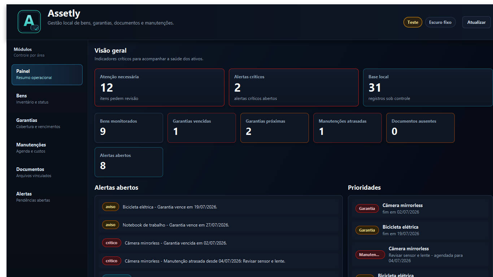
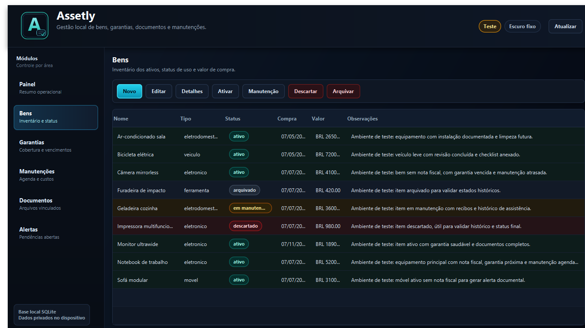
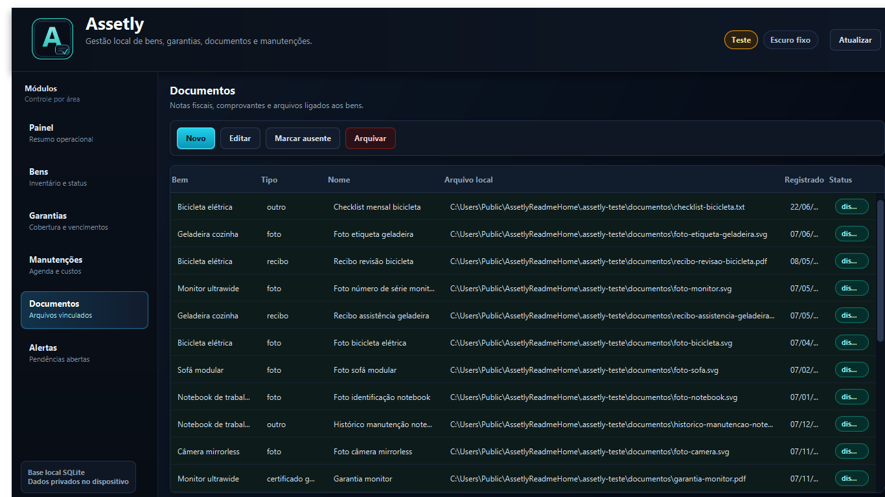

# Assetly

Assetly é um aplicativo de área de trabalho para organizar bens pessoais, garantias, documentos, manutenções e alertas em um banco local. Ele foi pensado para quem quer manter o controle dos próprios itens importantes sem depender de conta online, assinatura, nuvem ou telemetria.

O programa ainda está em fase de produto mínimo viável. Isso significa que ele já possui uma base funcional para uso e testes, mas ainda não tem instalador final para Windows nem pacote de distribuição pronto. Por enquanto, o download e a execução são feitos a partir do repositório do projeto.

## Visão Geral

Com o Assetly, você pode registrar itens como notebook, eletrodomésticos, ferramentas, bicicleta, móveis e outros bens. Para cada bem, é possível acompanhar garantias, anexar documentos, registrar manutenções e receber alertas sobre prazos importantes.

O foco do projeto é simples:

- manter seus dados no seu computador;
- organizar documentos e prazos em um só lugar;
- avisar sobre garantias vencendo, garantias vencidas, manutenções próximas, manutenções atrasadas e ausência de nota fiscal;
- oferecer um ambiente de teste completo para experimentar o aplicativo sem misturar dados fictícios com dados reais.

## Imagens do Programa

As imagens abaixo são capturas reais da interface atual, geradas a partir do ambiente de teste do Assetly. Elas usam dados fictícios e documentos demonstrativos criados pelo próprio aplicativo.

### Painel Inicial

O painel mostra os indicadores principais, alertas abertos e prioridades. Ele serve como ponto de partida para saber rapidamente o que precisa de atenção.



### Cadastro de Bens

A tela de bens concentra o inventário. Ela mostra tipo, status, data de compra, valor e observações de cada item registrado.



### Documentos Anexados

A tela de documentos lista os arquivos vinculados aos bens. No ambiente de teste, o Assetly gera anexos físicos reais em PDF, SVG, CSV e TXT.



## O Que Já Funciona

- Cadastro, edição, listagem e mudança de status de bens.
- Registro de garantias com período, tipo e fornecedor.
- Registro de manutenções preventivas, corretivas, inspeções e limpezas.
- Cadastro de documentos vinculados aos bens.
- Cópia dos documentos selecionados para um diretório local privado.
- Geração automática de alertas.
- Painel com indicadores, alertas e prioridades.
- Tema escuro fixo.
- Identidade visual própria com ícone do aplicativo.
- Ambiente de produção local.
- Ambiente de teste isolado com dados fictícios e anexos reais.

## Download

Enquanto o projeto ainda não possui instalador, existem duas formas práticas de baixar o Assetly.

### Opção 1: baixar com Git

Use esta opção se você já tem Git instalado e quer manter o projeto fácil de atualizar.

```powershell
cd C:\Users\denis\source\repos
git clone https://github.com/dcCarreto/Assetly.git
cd Assetly
```

Depois, quando quiser atualizar o código:

```powershell
git pull
```

### Opção 2: baixar como ZIP

Use esta opção se você não quer usar Git.

1. Acesse `https://github.com/dcCarreto/Assetly`.
2. Clique em `Code`.
3. Clique em `Download ZIP`.
4. Extraia o arquivo ZIP em uma pasta de sua preferência.
5. Abra o PowerShell dentro da pasta extraída.

Se baixar por ZIP, o projeto funciona normalmente, mas você não terá o fluxo simples de atualização por `git pull`.

## Requisitos

Para executar o Assetly hoje, você precisa de:

- Windows com PowerShell;
- JDK 21 ou superior;
- conexão com a internet na primeira execução para baixar dependências do Maven.

O projeto inclui Maven Wrapper (`mvnw` e `mvnw.cmd`). Isso significa que você não precisa instalar Maven manualmente para executar o aplicativo ou rodar os testes. O wrapper baixa a versão configurada do Maven quando necessário.

### Verificar Java

Abra o PowerShell e rode:

```powershell
java -version
```

O resultado deve indicar Java 21 ou superior. Se o comando não existir ou mostrar uma versão antiga, instale um JDK atual antes de executar o programa.

## Primeira Execução

Entre na pasta do projeto e execute:

```powershell
.\executar.ps1
```

Se o PowerShell bloquear a execução do script por política local, rode:

```powershell
powershell -ExecutionPolicy Bypass -File .\executar.ps1
```

Na primeira execução, o aplicativo compila o projeto, baixa dependências se necessário, cria o banco SQLite local e abre a janela principal.

## Escolher Produção ou Teste

O Assetly possui dois ambientes separados.

### Produção

Use produção para seus dados reais.

- Banco: `~/.assetly/banco/assetly.sqlite3`
- Documentos copiados: `~/.assetly/documentos/`

### Teste

Use teste para experimentar o sistema sem risco.

- Banco: `~/.assetly-teste/banco/assetly-teste.sqlite3`
- Documentos gerados ou copiados: `~/.assetly-teste/documentos/`

O ambiente de teste cria uma base demonstrativa com bens, garantias, manutenções, alertas e arquivos anexados. Esses arquivos são documentos físicos reais, gerados localmente, e aparecem no módulo `Documentos`.

### Alternar com Uma Linha

Abra [executar.ps1](executar.ps1) e altere somente esta linha:

```powershell
$env:ASSETLY_AMBIENTE = $env:ASSETLY_AMBIENTE_PRODUCAO
```

Para executar com dados fictícios, deixe assim:

```powershell
$env:ASSETLY_AMBIENTE = $env:ASSETLY_AMBIENTE_TESTE
```

Depois salve o arquivo e rode:

```powershell
.\executar.ps1
```

Você também pode executar o ambiente de teste sem editar o script:

```powershell
$env:ASSETLY_AMBIENTE = 'teste'
.\executar.ps1
```

Para voltar ao ambiente de produção no mesmo terminal:

```powershell
Remove-Item Env:ASSETLY_AMBIENTE
```

## Como Usar o Assetly

Esta seção descreve o fluxo de uso mais comum. Para experimentar sem medo, comece pelo ambiente de teste. Quando estiver confortável, alterne para produção e registre seus dados reais.

### 1. Acompanhar o Painel

Ao abrir o aplicativo, a primeira tela é o painel. Ele mostra:

- quantos itens pedem atenção;
- quantos alertas críticos estão abertos;
- quantos registros existem na base local;
- garantias vencidas;
- garantias próximas do vencimento;
- manutenções atrasadas;
- documentos ausentes;
- lista de alertas abertos;
- lista de prioridades.

Use o botão `Atualizar` no topo para recarregar os dados e gerar novamente os alertas automáticos.

### 2. Registrar um Bem

Entre no módulo `Bens` e clique em `Novo`.

Preencha:

- nome do bem;
- tipo;
- data de compra, se souber;
- valor de compra, se quiser acompanhar;
- observações.

Exemplos de bens:

- Notebook de trabalho;
- Geladeira cozinha;
- Bicicleta elétrica;
- Furadeira de impacto;
- Ar-condicionado sala;
- Sofá modular.

Depois de salvo, o bem aparece na tabela. Você pode selecionar uma linha e usar as ações `Editar`, `Detalhes`, `Ativar`, `Manutenção`, `Descartar` ou `Arquivar`.

### 3. Registrar Garantias

Entre em `Garantias` e clique em `Nova`.

Informe:

- bem relacionado;
- tipo de garantia;
- fornecedor;
- data inicial;
- data final.

O Assetly usa essas datas para indicar garantias ativas, próximas do vencimento ou vencidas. Ao abrir ou atualizar o aplicativo, alertas são gerados automaticamente quando uma garantia está vencendo em até 30 dias ou já venceu.

### 4. Registrar Manutenções

Entre em `Manutenções` e clique em `Nova`.

Informe:

- bem relacionado;
- tipo de manutenção;
- descrição;
- data agendada.

Você pode usar esse módulo para revisões, inspeções, limpezas, trocas de peças e assistências técnicas. Quando a manutenção for feita, selecione o registro e conclua a manutenção informando a data e o custo, se houver.

Manutenções vencidas aparecem como prioridade no painel.

### 5. Anexar Documentos

Entre em `Documentos` e clique em `Novo`.

Informe:

- bem relacionado;
- tipo do documento;
- nome do documento;
- arquivo de origem;
- data de registro.

Ao selecionar um arquivo, o Assetly copia esse arquivo para a pasta local do ambiente atual. Isso evita que o cadastro dependa do local original do arquivo, como `Downloads`, `Área de Trabalho` ou um pendrive.

No ambiente de produção, os documentos vão para:

```text
~/.assetly/documentos/
```

No ambiente de teste, os documentos vão para:

```text
~/.assetly-teste/documentos/
```

O banco guarda os metadados e o caminho local do arquivo armazenado. O arquivo real permanece no computador do usuário.

### 6. Usar Alertas

Entre em `Alertas` para ver pendências abertas.

O Assetly gera alertas automáticos para:

- garantia vencendo;
- garantia vencida;
- manutenção próxima;
- manutenção atrasada;
- ausência de nota fiscal para bens ativos ou em manutenção.

Você pode marcar um alerta como ciente ou resolvido. Um alerta resolvido deixa de aparecer como pendência acionável.

## Ambiente de Teste Completo

O ambiente de teste foi criado para validação do produto. Ele é útil para ver o aplicativo funcionando sem cadastrar nada manualmente.

Ao executar em modo teste, o Assetly cria ou completa uma base com:

- bens ativos, em manutenção, arquivados e descartados;
- garantias saudáveis, próximas do vencimento e vencidas;
- manutenções agendadas, atrasadas, concluídas e canceladas;
- alertas automáticos;
- notas fiscais em PDF;
- certificados de garantia em PDF;
- recibos em PDF;
- laudos em PDF;
- fotos demonstrativas em SVG;
- histórico de manutenção em CSV;
- checklist operacional em TXT.

O seed de teste é idempotente. Isso quer dizer que, se você já abriu o ambiente de teste antes, o programa adiciona apenas o que estiver faltando e evita duplicar registros pelo nome.

### Recriar o Ambiente de Teste do Zero

Se quiser apagar os dados fictícios e deixar o Assetly recriar tudo, feche o aplicativo e remova a pasta de teste:

```powershell
$pastaTeste = Join-Path $env:USERPROFILE '.assetly-teste'
Remove-Item -LiteralPath $pastaTeste -Recurse -Force
```

Depois rode novamente:

```powershell
.\executar.ps1
```

Use esse comando apenas para o ambiente de teste. Não remova `~/.assetly` se essa pasta já contém seus dados reais.

## Onde os Dados Ficam

O Assetly não salva dados reais dentro do repositório. As pastas de execução ficam no perfil do usuário.

Produção:

```text
%USERPROFILE%\.assetly\banco\assetly.sqlite3
%USERPROFILE%\.assetly\documentos\
```

Teste:

```text
%USERPROFILE%\.assetly-teste\banco\assetly-teste.sqlite3
%USERPROFILE%\.assetly-teste\documentos\
```

Essas pastas não devem ser versionadas. Elas podem conter documentos pessoais, notas fiscais, recibos e histórico patrimonial.

## Privacidade

O Assetly foi desenhado com prioridade local.

- Não exige conta.
- Não depende de nuvem.
- Não possui telemetria no produto mínimo viável.
- Não envia documentos para serviços externos.
- Usa SQLite local.
- Copia documentos para uma pasta privada no computador do usuário.

Mesmo assim, os dados continuam sendo responsabilidade do usuário. Se você usa dados reais, cuide de backup, criptografia de disco e proteção do seu usuário do Windows.

## Solução de Problemas

### O PowerShell diz que o script não pode ser executado

Use:

```powershell
powershell -ExecutionPolicy Bypass -File .\executar.ps1
```

Esse comando libera a execução apenas para essa chamada.

### O comando `java` não existe

Instale um JDK 21 ou superior e abra um novo terminal. Depois confirme:

```powershell
java -version
```

### O comando `mvn` não existe

Use o Maven Wrapper incluído no projeto:

```powershell
.\mvnw.cmd test
```

O [executar.ps1](executar.ps1) também prioriza o wrapper, então o aplicativo pode ser iniciado sem Maven instalado no PATH.

### O aplicativo abriu em teste quando eu queria produção

Abra [executar.ps1](executar.ps1) e deixe a linha de ambiente assim:

```powershell
$env:ASSETLY_AMBIENTE = $env:ASSETLY_AMBIENTE_PRODUCAO
```

Depois rode novamente:

```powershell
.\executar.ps1
```

### O aplicativo abriu em produção quando eu queria teste

Abra [executar.ps1](executar.ps1) e deixe a linha de ambiente assim:

```powershell
$env:ASSETLY_AMBIENTE = $env:ASSETLY_AMBIENTE_TESTE
```

Depois rode novamente:

```powershell
.\executar.ps1
```

## Desenvolvimento

O projeto usa Java 21, JavaFX, Maven, SQLite, JUnit 5 e AssertJ.

A arquitetura é organizada em camadas:

- `dominio`: entidades, objetos de valor, enums e regras centrais.
- `aplicacao`: casos de uso, comandos e contratos de repositório.
- `infraestrutura`: SQLite, migrações, repositórios e armazenamento local.
- `apresentacao`: contexto da aplicação e interface JavaFX.

Estrutura principal:

```text
Assetly/
├── README.md
├── LICENSE
├── ROADMAP.md
├── executar.ps1
├── pom.xml
├── docs/
│   └── imagens/
└── src/
    ├── main/
    │   ├── java/
    │   └── resources/
    └── test/
        └── java/
```

### Executar Testes

Com Maven Wrapper:

```powershell
.\mvnw.cmd test
```

Antes de propor uma alteração, confira:

```powershell
.\mvnw.cmd test
git status --short
```

## O Que Ainda Está Planejado

- Empacotamento com `jlink` ou `jpackage`.
- Instalador para Windows.
- Exportação CSV e JSON.
- OCR para notas fiscais.
- Leitura de QR Code.
- Cópias de segurança criptografadas.
- Sincronização opcional.
- Modo família.
- Controle avançado de veículos e imóveis.
- Depreciação estimada.
- Splash screen e pacote de identidade visual expandido.
- Internacionalização.

## Licença

Assetly é distribuído sob a licença MIT. Consulte [LICENSE](LICENSE).
